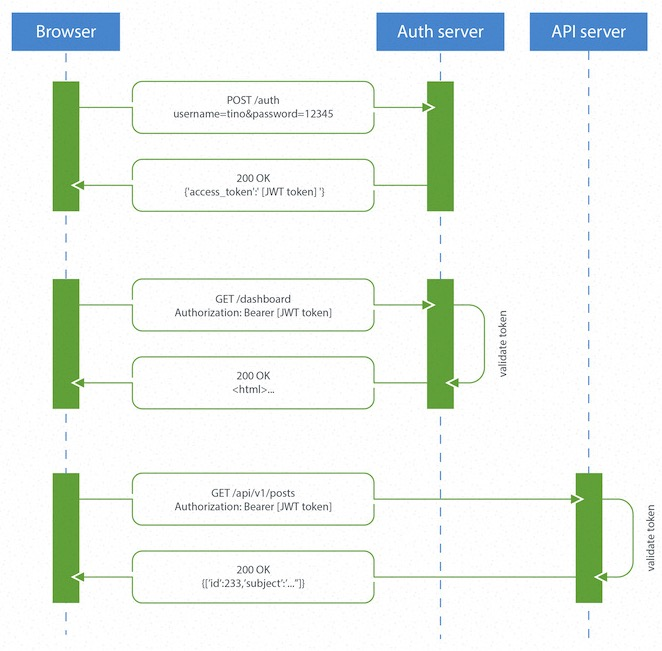

# web 身份验证   

## 为什么需要身份验证   

    HTTP 无状态；web 应用个性化；鉴权

## 认证基本方法及优缺点  

    1、http 认证   
    2、cookie/session/token（jwt）   

### HTTP 认证

#### 基本认证   
> 关键技术  
> base64(用户名:口令)   

> 流程   
  

> 优势  
> 1. 简单，几乎所有流行网页浏览器都支持
> 劣势   
> 1. 编码这一步骤的目的并不是安全与隐私，而是为将用户名和口令中的不兼容的字符转换为均与HTTP协议兼容的字符集。
> 2. 明文传输，对客户端和服务器端传递的信息均无保护机制，有把用户名和密码暴露给第三方的风险，很少在公开访问的网站应用。  
> 3. 无登出机制；浏览器会缓存登录信息，但没有一种机制用于服务器指导客户端丢弃缓存信息。（手动清浏览器缓存数据、关闭浏览器或用错误的认证信息替换掉已有的认证信息）

#### 摘要认证   
> 关键技术  
> 随机数（cnonce, nonce）；md5不可逆哈希加密；不直接在网络传输敏感信息，传输不可逆加密后的摘要信息；

> 流程：和基本认证流程一致；不同的是，头部信息多了加密算法和随机数的设定；

> 优势 
> 1. 客户端和服务器之间的传输和验证，都是摘要形式，不直接使用明文密码，因此可以实现密码加密存储；  
> 2. 有客户端随机数（cnonce 防止选择明文攻击，彩虹表）和服务器随机数可以包含时间戳（nonce 防止重放攻击）  

> 劣势
> 1. 没有客户端验证服务器的机制，容易收到中间人攻击   
> 2. 本身设计意图是取代基本认证，并没有取代强认证协议的设计   
> 3. 和基础认证一样，无登出机制  

> 可替代：   
> 1. 强认证协议：公共密码学等    
> 2. 基本认证 + https 传输

### cookie/session/token    

> cookie      
> 关键技术点： Set-cookie, Cookie    

> 流程： 
   

> 优势  
> 简单，由服务器和浏览器完成保存和验证工作，无需前端参与；

> 劣势  
> cookie 容易被盗取和篡改  

> session   
> 关键技术点： 
> 1. 服务器生成并保存会话对象 session   
> 2. Set-cookie 保存 sessionid 到浏览器端  

> 优势  
> 1. cookie 不保存敏感信息   

> 劣势   
> 1. 服务器需要保存状态   
> 2. 分布式集群同步session   
> 3. 跨域，因为需要cookie 保存sessionid    
> 4. cookie 原生移动端应用不支持cookie      

> token      
> 关键技术点： JSON, base64Url, 签名算法   

> 流程  
 

> 优势   
> 1. 无状态：服务器不保存信息，易扩展，便于分布式集群认证   
> 2. 存储和传输的多样性： 可跨域；防止CRSF攻击；更适合移动端   
> 3. 性能： 一次网络往返时间（通过数据库查询session信息）总比做一次HMACSHA256计算 的Token验证和解析要费时得多   
> 4. 标准化（JSON WEB TOKEN）

> 劣势  
1. 用户登录验证过程，用户名和密码在网络中传输时，建议使用 HTTPS   
2. TOKEN 一旦生成并发送到客户端，在有效期内，无法通过服务器端指导客户端删除：缩短token有效时间   
3. 重放攻击：缩短token 有效时间   
4. 中间人攻击： token 通过 HTTPS 传输   

> jwt  
> 1. 默认使用 HS256 算法： 对称加密   
> 2. 可以选择使用 RS256 算法： 非对称加密；私钥用于签发token, 公钥用于验证   

## 应用场景及常见解决方案  

    1、单系统     
    2、多系统   
    3、开放平台（oAuth）    

参考列表：   

http认证： 基本认证，摘要认证  

    基本认证： 

        参考：
        https://zh.wikipedia.org/wiki/HTTP%E5%9F%BA%E6%9C%AC%E8%AE%A4%E8%AF%81   
        http://www.cnblogs.com/xiaohuochai/p/6184913.html  
        http://www.nanodocumet.com/?p=6  

        ps: base64 http协议兼容， 如路由器网页管理接口，没有有效的方式让用户退出？

    摘要认证：    

        参考：
        https://zh.wikipedia.org/wiki/HTTP%E6%91%98%E8%A6%81%E8%AE%A4%E8%AF%81    
        https://www.cnblogs.com/xiaohuochai/p/6189065.html

    https://www.hackingarticles.in/understanding-http-authentication-basic-digest/

cookie/session/token 

    参考：   
    https://abigaleyu.co/2017/07/28/cookie-session-token/    
    https://harttle.land/2015/08/10/cookie-session.html    cookie 容易被篡改；session: 防止篡改，但是被盗用后，可以重放   
    https://www.jianshu.com/p/c33f5777c2eb    cookie/session: 有状态（服务器或浏览器端需要一直保存状态），token无状态  
    https://blog.csdn.net/Jmilk/article/details/55686267   session，token优缺点   
    https://segmentfault.com/a/1190000013010835#articleHeader0    token无状态的特点，可以做到分离认证；业务服务器不受信的情况下（非对称加密，申请注册）

jwt

    参考：   
    https://ninghao.net/blog/2834    
    http://www.ruanyifeng.com/blog/2018/07/json_web_token-tutorial.html     
    https://bbs.huaweicloud.com/blogs/06607ea7b53211e7b8317ca23e93a891   安全性介绍，demo注意应用  
    http://blog.didispace.com/learn-how-to-use-jwt-xjf/   
    https://juejin.im/entry/5993a030f265da24941202c2    并不是每种场景都适用jwt   

oauth   

    参考：  
    https://www.xncoding.com/2017/03/29/web/oauth2.html  
    https://www.jianshu.com/p/a047176d9d65   

sso:    

    https://www.cnblogs.com/lyzg/p/6132801.html   
    https://www.cnblogs.com/ywlaker/p/6113927.html    

    demo 演示；taobao等网站例子    

sso 方案： （同域，跨域，子应用受信任，子应用不受信任）   
cas

demo 参考：   

https://www.cnblogs.com/chyingp/p/nodejs-learning-crypto-theory.html   
