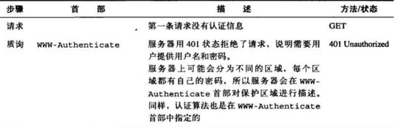
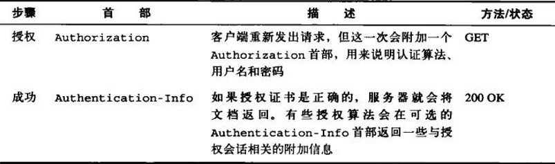

# web 身份验证   

## 为什么需要身份验证   

    HTTP 无状态；web 应用个性化；鉴权

## 认证基本方法及优缺点  

    1、http 认证   
    2、cookie/session/token   
    3、jwt   

### HTTP 认证

#### 基本认证   
> 关键技术  
> base64(用户名:口令)   

> 流程   
  

> 优势  
> 1. 简单，几乎所有流行网页浏览器都支持
> 劣势   
> 1. 明文传输，对客户端和服务器端传递的信息均无保护机制，很少在公开访问的网站应用。编码这一步骤的目的并不是安全与隐私，而是为将用户名和口令中的不兼容的字符转换为均与HTTP协议兼容的字符集。  
> 2. 无登出机制；浏览器会缓存登录信息，但没有一种机制用于服务器指导客户端丢弃缓存信息。（关闭浏览器或用错误的认证信息替换掉已有的认证信息）

#### 摘要认证   
> 关键技术  

> 优势 

> 劣势

### cookie/session/token    

> cookie  

> session   

> token   

### jwt(JSON WEB TOKEN)  

## 应用场景及常见解决方案  

    1、单系统     
    2、多系统   
    3、开放平台（oAuth）    

参考列表：   

http认证： 基本认证，摘要认证  

    基本认证： 

        参考：
        https://zh.wikipedia.org/wiki/HTTP%E5%9F%BA%E6%9C%AC%E8%AE%A4%E8%AF%81   
        http://www.cnblogs.com/xiaohuochai/p/6184913.html  
        http://www.nanodocumet.com/?p=6  

        ps: base64 http协议兼容， 如路由器网页管理接口，没有有效的方式让用户退出？

    摘要认证：    

        参考：
        https://zh.wikipedia.org/wiki/HTTP%E6%91%98%E8%A6%81%E8%AE%A4%E8%AF%81    
        https://www.cnblogs.com/xiaohuochai/p/6189065.html

    https://www.hackingarticles.in/understanding-http-authentication-basic-digest/

cookie/session/token 

    参考：   
    https://abigaleyu.co/2017/07/28/cookie-session-token/    
    https://harttle.land/2015/08/10/cookie-session.html    cookie 容易被篡改；session: 防止篡改，但是被盗用后，可以重放   
    https://www.jianshu.com/p/c33f5777c2eb    cookie/session: 有状态（服务器或浏览器端需要一直保存状态），token无状态  
    https://blog.csdn.net/Jmilk/article/details/55686267   session，token优缺点   
    https://segmentfault.com/a/1190000013010835#articleHeader0    token无状态的特点，可以做到分离认证；业务服务器不受信的情况下（非对称加密，申请注册）

jwt

    参考：   
    https://ninghao.net/blog/2834    
    http://www.ruanyifeng.com/blog/2018/07/json_web_token-tutorial.html     

oauth   

    参考：  
    https://www.xncoding.com/2017/03/29/web/oauth2.html  
    https://www.jianshu.com/p/a047176d9d65   

sso:    

    https://www.cnblogs.com/lyzg/p/6132801.html   
    https://www.cnblogs.com/ywlaker/p/6113927.html    

    demo 演示；taobao等网站例子    

sso 方案： （同域，跨域，子应用受信任，子应用不受信任）   

    

cas